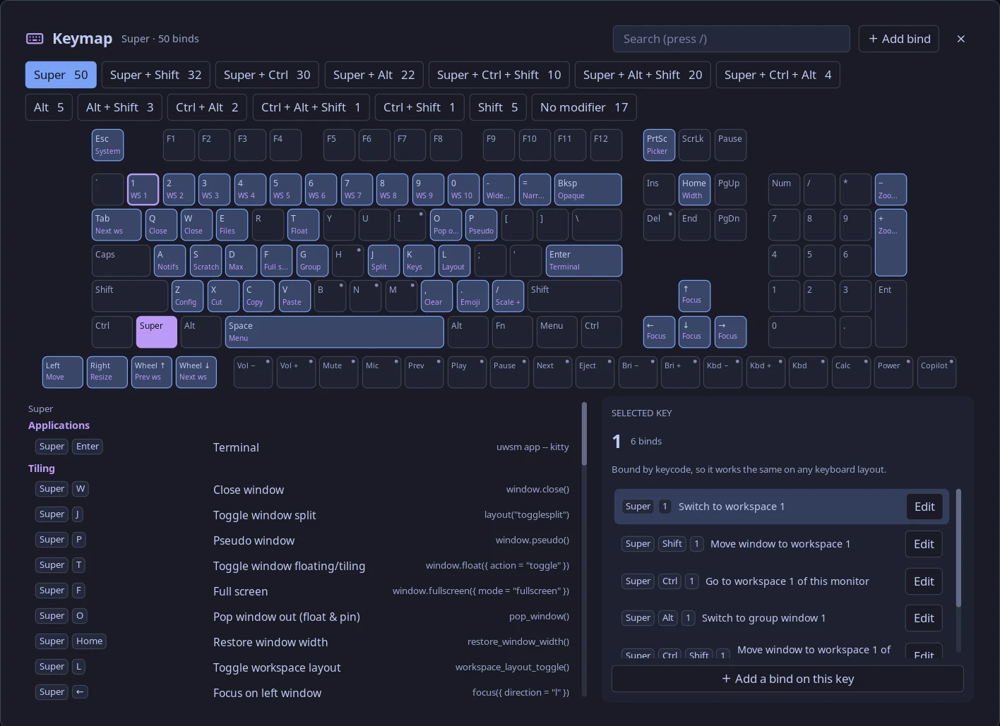

# Hyprland Keymap

A [Noctalia](https://noctalia.dev) plugin that puts your Hyprland binds on a keyboard map. Pick a modifier layer to
see what every key does, search all your binds, and move, change, turn off or add binds from the panel.



## Requirements

- Noctalia 5.1 or newer (plugin API 30)
- Hyprland with a Lua config (`hyprland.lua`, Hyprland 0.56+). With a `hyprland.conf` setup the keymap still opens,
  read-only, showing your binds from `hyprctl`.
- `lua` (5.4 or newer) and `python3` on your `PATH`

## Install

Add this repo as a plugin source and enable the plugin:

```sh
noctalia msg plugins source add hypr-keymap git https://github.com/flopet/hypr-keymap
noctalia msg plugins enable flopet/hypr-keymap
```

If `noctalia msg panel-toggle flopet/hypr-keymap:keymap` then says the panel is unknown, disable and enable the plugin
once more; Noctalia registers new panels when a plugin is enabled.

Open the keymap from:

- **The bar:** add the widget in Noctalia's bar settings, or in your config, then put `"keymap"` in one of the bar's
  `start`, `center` or `end` lists:
  ```toml
  [widget.keymap]
  type = "flopet/hypr-keymap:button"
  ```
- **A Hyprland bind:**
  ```lua
  hl.bind("SUPER + K", hl.dsp.exec_cmd("noctalia msg panel-toggle flopet/hypr-keymap:keymap"), { description = "Keybindings" })
  ```

In the panel, `/` jumps to the search and Escape closes it.

## Turn on editing

Editing needs a small hook in your Hyprland config. It records your binds as Hyprland loads them and applies the
panel's edits on top, so your own config files are never rewritten.

1. Copy the hook next to your `hyprland.lua` (after the install above, Noctalia keeps the plugin here; the file is
   also [in this repo](hypr-keymap/hyprland/keymap.lua)):
   ```sh
   cp ~/.local/state/noctalia/plugins/materialized/hypr-keymap/hypr-keymap/hyprland/keymap.lua ~/.config/hypr/
   ```
2. Add two lines to `hyprland.lua`:
   ```lua
   local keymap = require("keymap")   -- first line, before any binds

   -- ... the rest of your config ...

   keymap.apply()                      -- last line
   ```

Edits are saved to `~/.config/hypr/keymap-overrides.lua`, a short Lua list you can also edit by hand, and Hyprland
reloads after each save. If the reload reports new config errors, the edit is rolled back. **Reset to default** undoes
one edit; deleting the file undoes them all.

## Settings

| Setting | Default | What it does |
| --- | --- | --- |
| Hyprland config | `~/.config/hypr/hyprland.lua` | The config the keymap loads to read your binds. |

## How it works

The panel doesn't parse your config. `backend/gen.lua` runs it with standalone Lua against a stand-in `hl` that records
every `hl.bind` call and ignores everything else (autostart commands, rules and settings don't run), then hands the
binds to the panel as JSON. Descriptions come from each bind's `description` option. Sections come from header comments
such as `---- TILING ----` above the binds, or else from file names. `backend/save.py` writes edits and reloads
Hyprland.

## Troubleshooting

- **The panel is read-only and mentions the hook:** the hook isn't loaded, or `keymap.apply()` is missing at the end of
  `hyprland.lua`.
- **Some binds are missing:** the panel shows where your config stopped loading. Code that needs a running compositor
  while the config loads, such as querying monitors, can stop the stand-in early.
- Noctalia logs to `~/.cache/noctalia/noctalia.log`.

## Development

Point Noctalia at a checkout instead of GitHub; edits to `.luau` files then hot-reload:

```sh
noctalia msg plugins source add hypr-keymap path ~/Projects/hypr-keymap
noctalia msg plugins enable flopet/hypr-keymap
```

After changing `plugin.toml`, disable and enable the plugin. For a release, bump the version in both
`hypr-keymap/plugin.toml` and `catalog.toml`.

| Path | Contents |
| --- | --- |
| `catalog.toml` | Plugin index Noctalia reads from a source repo |
| `hypr-keymap/plugin.toml` | Manifest: entries, panel size, settings |
| `hypr-keymap/panel.luau` | The panel |
| `hypr-keymap/widget.luau` | The bar button |
| `hypr-keymap/backend/` | `gen.lua` reads binds, `save.py` saves edits |
| `hypr-keymap/hyprland/keymap.lua` | The hook users copy into their Hyprland config |

## License

[MIT](LICENSE)
